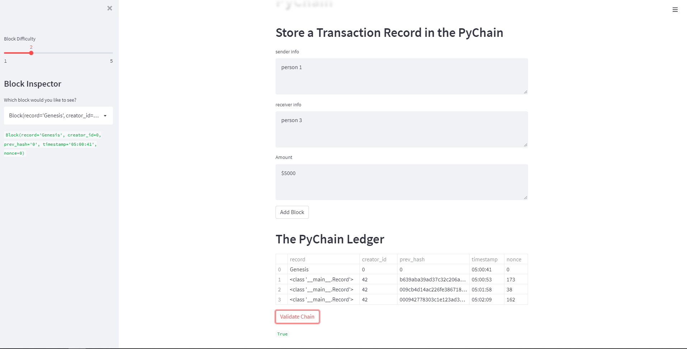

# Blockchain-homework

As per homework instruction, a web interface has been created with the following:

- an input for sender information
- an input for receiver information
- the amount
- button to store above information in a block and add to chain
- dataframe of the ledger
- button to validate the chain

